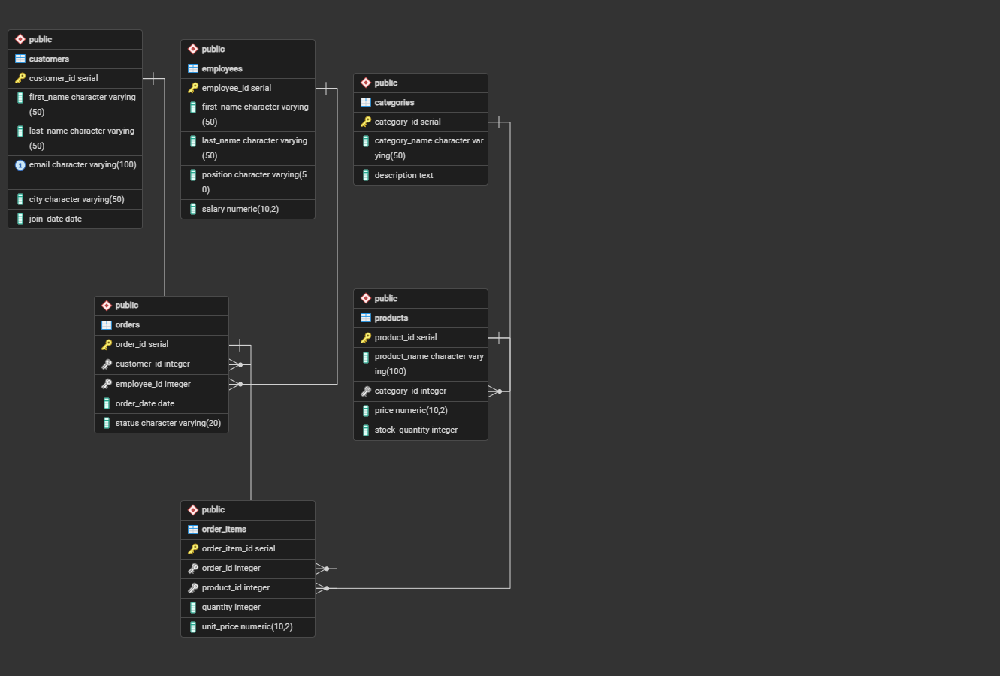

# Retail Shop Database

A normalized relational database for a fictional South African retail shop, built in PostgreSQL as the Month 1 capstone project of my Data Engineering self-study roadmap.

## Overview

This project simulates the backend database for a retail shop that manages products, customers, employees, orders, and inventory. It demonstrates core SQL concepts through realistic business scenarios and analytical queries.

The database contains **6 normalized tables** connected through primary and foreign key relationships, representing a typical transactional retail system.

The database can answer questions such as:

- Which products generate the most revenue?
- Which employees process the most sales?
- Which customers spend the most?
- Which products have never been ordered?
- What is the monthly sales revenue?

---

## Entity Relationship Diagram

---

## Database Structure

| Table | Description |
|------|-------------|
| `categories` | Product categories |
| `products` | Products sold by the shop |
| `customers` | Customers who place orders |
| `employees` | Employees who process orders |
| `orders` | Customer orders |
| `order_items` | Individual products within each order |

---

## Repository Structure

| File | Purpose |
|------|---------|
| `schema.sql` | Creates all database tables, constraints, and foreign keys |
| `sample_data.sql` | Inserts realistic sample data |
| `queries.sql` | Business queries demonstrating SQL concepts learned during Month 1 |
| `views.sql` | Reporting views |
| `indexes.sql` | Performance indexes |
| `ERD.png` | Entity Relationship Diagram generated using pgAdmin 4 |

---

## SQL Concepts Demonstrated

### Database Design

- Database normalization (1NF, 2NF, 3NF)
- Primary keys
- Foreign keys

### Querying

- SELECT
- WHERE
- ORDER BY
- GROUP BY
- HAVING
- Aggregate functions

### Joins

- INNER JOIN
- LEFT JOIN
- RIGHT JOIN

### Advanced SQL

- Subqueries
  - WHERE
  - FROM
  - Correlated
- Common Table Expressions (CTEs)
- CASE WHEN
- String functions
- Date functions
- Window functions (`RANK()`)

### Database Objects

- Views
- Indexes

---

## Learning Objectives

This project was created to reinforce:

- Relational database design
- SQL querying
- Database normalization
- Business reporting using SQL
- Query optimization fundamentals

---

## How to Run

1. Create a PostgreSQL database named `retail_shop`.
2. Execute `schema.sql`.
3. Execute `sample_data.sql`.
4. Execute `queries.sql`.
5. (Optional) Execute `views.sql` and `indexes.sql`.

---

## Technologies

- PostgreSQL
- pgAdmin 4
- Git
- GitHub

---

## Future Improvements

Planned enhancements include:

- Stored procedures
- Database functions
- Triggers
- Transactions
- Additional analytical queries
- Performance tuning with `EXPLAIN ANALYZE`

---

## License

This project is licensed under the MIT License.